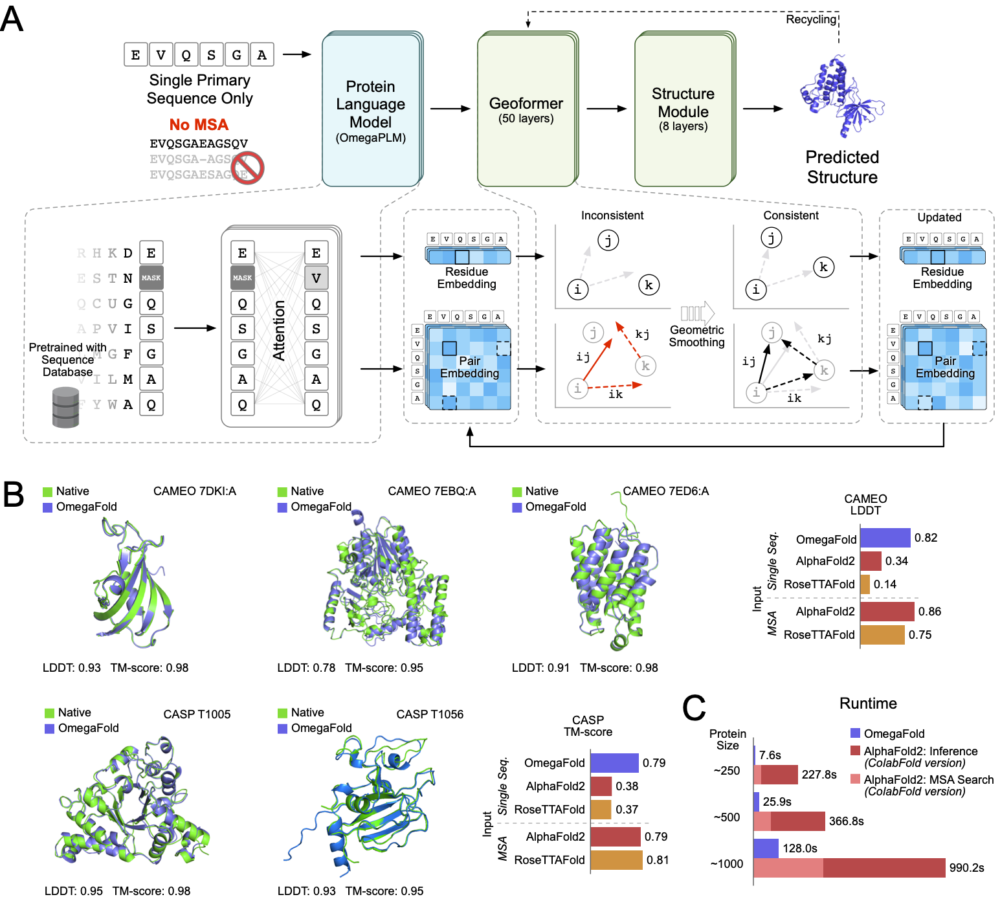

# OmegaFold: High-resolution de novo Structure Prediction from Primary Sequence

#### This is a beta release for paper [High-resolution de novo structure prediction from primary sequence](https://www.biorxiv.org/content/10.1101/2022.07.21.500999v1), the weights and the final code will be released soon.

## Setup

To prepare the environment to run OmegaFold,

```commandline
pip install -r requirements.txt
```

should get you where you want.
Even if this failed, since we use minimal 3rd party libraries, you can
always just install
[PyTorch](https://pytorch.org)
and
[biopython](https://biopython.org)
(and that's it!)
yourself.

## Running

There should be only one way to use the model:

```commandline
python main.py INPUT_FILE.fasta OUTPUT_DIRECTORY
```

And voila!

The `INPUT_FILE.fasta` should be a normal fasta file with possibly many
sequences.

However, since we have implemented sharded execution, it is possible to

1. trade computation time with GRAM: by chainging `--subbatch_size`. The
   smaller
   this value is, the longer the execution can take, and the less memory is
   required, or,
2. trade computation time with average prediction quality, by changing
   `--num_cycle`

For more information, run

```commandline
python main.py --help
```

## Output

We produce one pdb for each of the sequences in `INPUT_FILE.fasta` saved in
the `OUTPUT_DIRECTORY`. We also put our confidence value the place of
b_factors in pdb files.

## Cite

If this is helpful to you, please consider citing the paper with

```tex
@article{OmegaFold,
	author = {Wu, Ruidong and Ding, Fan and Wang, Rui and Shen, Rui and 
       Zhang, Xiwen and Luo, Shitong and Su, Chenpeng and Wu, Zuofan and Xie, 
       Qi and Berger, Bonnie and Ma, Jianzhu and Peng, Jian},
	title = {High-resolution de novo structure prediction from primary sequence},
	elocation-id = {2022.07.21.500999},
	year = {2022},
	doi = {10.1101/2022.07.21.500999},
	publisher = {Cold Spring Harbor Laboratory},
	URL = {https://www.biorxiv.org/content/early/2022/07/22/2022.07.21.500999},
	eprint = {https://www.biorxiv.org/content/early/2022/07/22/2022.07.21.500999.full.pdf},
	journal = {bioRxiv}
}

```

## Note

The weights of the model will be release soon, as well as some minor tweaks
of the code to make it more efficient either in computation or in memory to
make it as widely-available as possible.

Also some of the comments might be out-of-date as of now, and will be
updated very soon